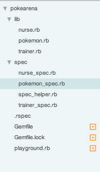

# Homework W02/D02

## PokeArena
Finish Pokearena (make all the tests pass)

see: `pokearena.md` in W02/D01

Make sure you have copied the `Gemfile` file from the 'starter' code, and
that you're writing your classes in the `lib/` folder.

* After you've copied the `Gemfile` run `bundle install` from the main `pokearena` folder
* To run the tests, run `rspec` from the `pokearena` folder

### File Structure

## Optional Additional Practice

Complete Testfirst.org exercises 1-4
